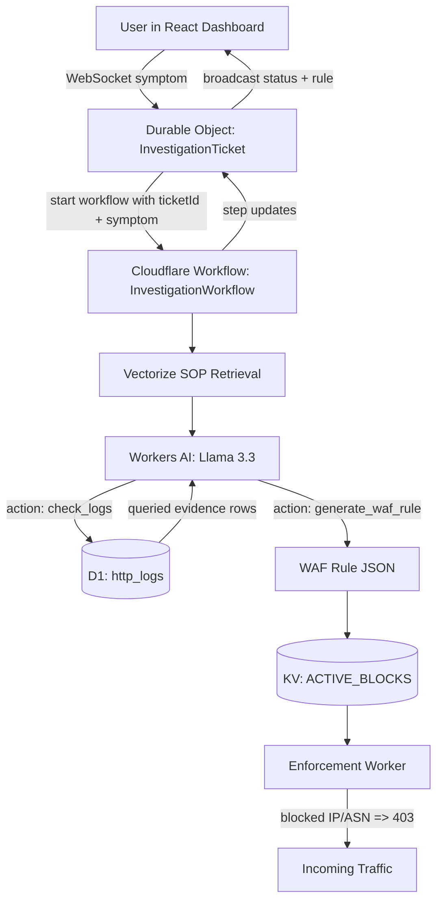
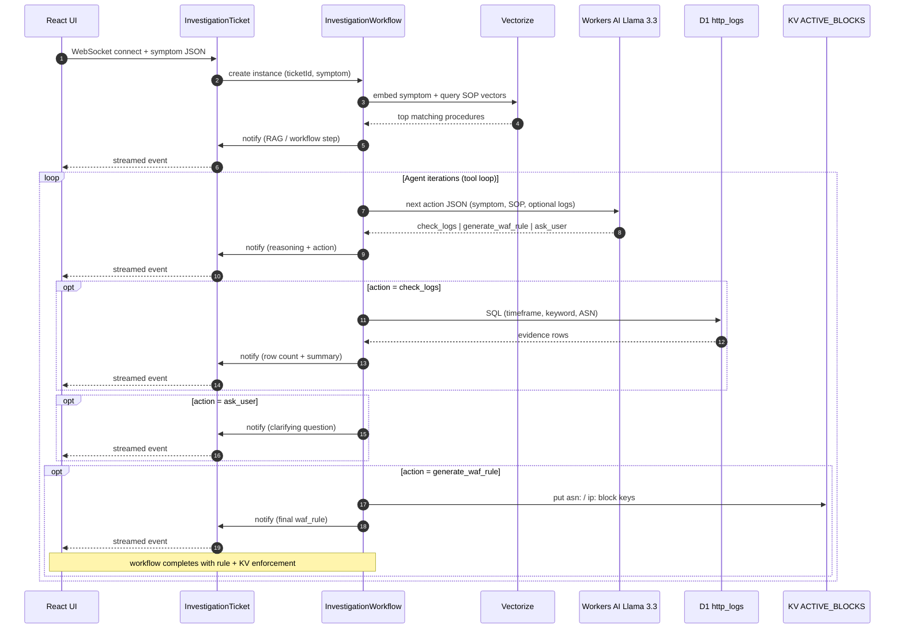

# Autonomous Edge Security Agent (AESA)

An autonomous security investigation pipeline on the Cloudflare developer platform. AESA combines **Workers AI (Llama 3.3)**, **Cloudflare Workflows**, **Durable Objects**, **D1**, **Vectorize**, **KV**, and a **React** dashboard with **WebSockets** for live updates.

**Hosted at:** [https://soc-agent.csramineni.workers.dev/](https://soc-agent.csramineni.workers.dev/)


## What this program does

AESA is a **demo SOC-style agent** that runs entirely on Cloudflare. You type a **symptom** in the dashboard (for example, suspicion of SQL injection, odd traffic from an ASN, or abuse on a path). The backend **investigates that report**: it can **pull evidence from a real D1 table** of synthetic HTTP request logs, **reason about what it sees**, and **emit a WAF-oriented mitigation** (JSON rule) plus optional **KV block keys** so a separate enforcement worker can **403** matching IPs or ASNs. The UI streams each step over **WebSockets** so you see triage, log hits, and the final rule as they happen.

## How tool calling finds malicious traffic

This repo does **not** use a vendor `tools` / `function_call` API. Instead, **Llama 3.3 is prompted to return only JSON** each turn, with an `action` field the workflow treats as the **next tool**:

| `action` | What runs in code | Role in finding or stopping malicious behavior |
| --- | --- | --- |
| `check_logs` | **D1 SQL** on `http_logs` using parameters such as `timeframe` (`last_10_mins`, `last_hour`, `last_24h`), `suspicious_keyword` (e.g. `UNION`, `script`), and optional `asn`. | Surfaces **concrete rows**: timestamps, source ASN/IP, `threat_type`, request path/body snippets, **signatures**, and an `is_malicious` flag—so the model works from **queried evidence**, not a canned string. |
| `generate_waf_rule` | Builds a **Cloudflare WAF–style rule** (expression + metadata) from LLM **parameters** and from **aggregated log evidence** (e.g. dominant ASN, payload/signature). Then writes **`asn:` / `ip:`** entries to **KV** for enforcement. | Turns confirmed indicators into a **narrow block** (ASN + dangerous substring in URI/body) and optional **live blocking** via the enforcement worker. |
| `ask_user` | Broadcasts a **clarifying question** to the client when the symptom is ambiguous. | Avoids guessing before querying logs. |

**Retrieval (RAG):** The workflow **embeds the symptom**, queries **Vectorize** for short **SOP** passages (SQLi, XSS, DDoS, etc.), and injects them into the system prompt. That nudges the model toward **playbook-consistent** keywords and sequencing (e.g. gather logs before blocking).

**Typical loop:** The workflow may execute **`check_logs` → read rows back into the next LLM turn → repeat** with sharper keywords, then **`generate_waf_rule`** once there is evidence—i.e. a simple **reason → query → observe → reason** loop without hardcoded attack strings in application code.

## Architecture



### Investigation lifecycle (sequence)



### Backend (`soc-agent/`)

| Layer | Role |
| --- | --- |
| **Durable Object** (`InvestigationTicket`) | WebSocket sessions, ticket id from the upgrade URL, broadcast to clients. Starts a **Workflow** when a symptom is received. |
| **Workflow** (`InvestigationWorkflow`) | Durable multi-step run: RAG → LLM tool loop → **D1** log queries → WAF rule → **KV** enforcement keys. Survives timeouts better than a long `for` loop in a DO. |
| **Workers AI** | `@cf/meta/llama-3.3-70b-instruct-fp8-fast` for JSON tool decisions; `@cf/baai/bge-small-en-v1.5` for embeddings (Vectorize + symptom). |
| **D1** | `http_logs` table: synthetic edge request rows. `check_logs` runs real SQL (timeframe, keyword, optional ASN). |
| **Vectorize** | SOP snippets embedded and queried for retrieval-augmented prompts. |
| **KV** (`ACTIVE_BLOCKS`) | On finalize, stores `asn:<id>` / `ip:<addr>` for optional enforcement. |
| **HTTP** | Status page, `/health`, `/?test=ai` diagnostics. |

### Enforcement worker (`enforcement-worker/`)

A small separate Worker that reads the same **KV** namespace and returns **403** when the request’s `cf-connecting-ip` or ASN matches a stored block. Deploy it on its own route or `*.workers.dev` to demo end-to-end blocking.

### Frontend (`frontend/`)

React + Tailwind + **Catppuccin Mocha**: terminal-style UI, live WebSocket stream, WAF rule display.

## Prerequisites

- Node.js 18+
- [Wrangler](https://developers.cloudflare.com/workers/wrangler/install-upgrading/) (`wrangler login`)
- Cloudflare: Workers AI, Durable Objects, D1, KV, Vectorize, and Workflows available on your account

## Local development

1. **Clone and install (monorepo)**

   ```bash
   git clone <repository-url>
   cd cf_ai_soc_agent
   npm install
   ```

2. **Backend**

   ```bash
   cd soc-agent
   npx wrangler dev
   ```

   Default: `http://localhost:8787`. Create D1/KV/Vectorize resources and bind IDs in `wrangler.jsonc` if you have not already (`wrangler d1 create`, `wrangler kv namespace create`, `wrangler vectorize create`, etc.).

3. **Seed local D1 (optional)**

   After applying migrations:

   ```bash
   cd soc-agent
   npx wrangler d1 migrations apply soc-logs --local
   node scripts/generate-d1-seed.mjs
   npx wrangler d1 execute soc-logs --local --file=./seed.sql
   ```

   `seed.sql` is generated and listed in `.gitignore`. For **remote** D1: `npm run seed:d1` (applies the generated seed to the remote database).

4. **Frontend**

   ```bash
   cd ../frontend
   echo "VITE_BACKEND_WS_URL=ws://localhost:8787" > .env
   npm run dev
   ```

   Open `http://localhost:5173`.

## Deployment

### Main Worker + workflow

```bash
cd soc-agent
npx wrangler deploy
```

### Frontend (Pages)

```bash
cd frontend
npm run build
npx wrangler pages deploy dist --project-name soc-agent-dashboard
```

Set `VITE_BACKEND_WS_URL` to your production Worker WebSocket URL (e.g. `wss://soc-agent.<user>.workers.dev`) when building for production.

### Enforcement Worker

```bash
cd enforcement-worker
npm install
npx wrangler deploy
```

Use the same KV namespace IDs as in `soc-agent/wrangler.jsonc` so blocks written by the SOC agent are visible here.

## Investigation flow (summary)

Same pipeline as in [How tool calling finds malicious traffic](#how-tool-calling-finds-malicious-traffic): WebSocket symptom → **InvestigationWorkflow** → RAG → JSON **action** loop → optional **D1** queries → **WAF rule** + **KV** → streamed updates via the Durable Object.

## License

MIT. Built for the Cloudflare AI SOC Agent Internship.
